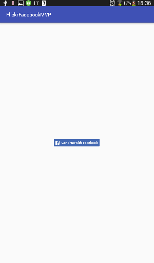
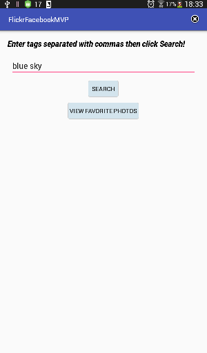
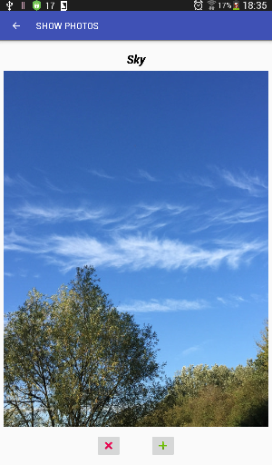
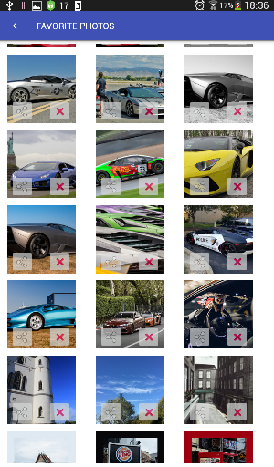
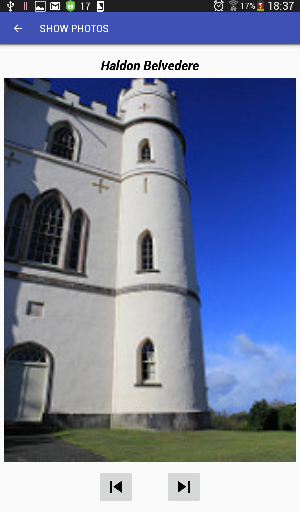

# MVPsample+testing

This is a sample project based on the MVP pattern + Dagger for dependency injection. It uses Facebook for login, the Flickr API to get the required photos and DBflow to store favorite photos.
The user can swipe right or down on the photo to save it in favorites,or swipe up or left to load the next photo.

**NB :** The Flickr response is limited in this project to 15 photos, to change it, go to ShowPhotosRepository interface and set PER_PAGE = "YOUR NUMBER HERE".

**ScreenShots:**

### Libraries

1. **Dagger 2**
2. **ButterKnife**
3. **Retrofit**
4. **Glide**
5. **DBflow**
6. **EventBus**

### Testing

The project is unit tested using :

1. **Mockito**
2. **Robolectric**

### APIs

1. **Facebook**
2. **Flickr**

### API Keys

To be able to test the app, you should provide your own keys:

1. **Facebook :**
Go to local ~/.gradle/gradle.properties file then "FACEBOOK_APP_ID = "INSERT_YOUR_APP_ID_HERE" then "fb_login_protocol_scheme = "INSERT_YOUR_APP_ID_HERE" (NB : to get the fb_login_protocol_scheme key, add "fb" prefix to your FACEBOOK_APP_ID ).

1. **Flickr :**
Go to local ~/.gradle/gradle.properties file then "FLICKR_API_KEY = "INSERT_YOUR_API_KEY_HERE".